# React

0. 定义:

        - 操作虚拟DOM以将数据渲染为HTML视图的开源JavaScript库

1. React的优点:

        - 采用组件化模式, 声明式编码, 提高开发效率以及组件复用率 (extensive)
        - 在React Native中可以使用React语法进行移动端开发 (useful)
        - 使用虚拟DOM + 优秀的Diffing 算法, 尽量减少与真实DOM的交互 (performance)

2. Jsx:
        
        - 全称: JavaScript XML, 一种类似于XML的js扩展语法: js + XML
        - 本质是React.createElement(compoennt, props, ..)方法的语法糖, 因而极大地简化了virtual dom对象创建的代码量 (纯js创建虚拟DOM: React.createElement(...))
        - 需要babel进行翻译, 翻译成React.createElement(...)的形式
        - 最终被创建virtual dom对象就是一个普通的js对象
        
        
        jsx的语法:
            - 定义虚拟DOM时, 不要写引号
            - 标签中混入js表达式时要使用{}, 一个表达式会产生一个值, 可以放在任何一个需要值的地方, eg: a, a+b, demo(1), arr.map(), function test() {}, 而不能是语句/代码
            - 样式的类名指定不要用class, 要用className="..."
            - inline样式要用style={{key: value}}的形式来写
            - 只能有一个根标签, 如果有多个用

包起来
            - 标签必须闭合
            - 标签首字母:
                (1). 若小写字母开头, 则将标签改为html同名元素; 若html中没有对应标签, 则报错
                (2). 若大写字母开头, 则会视为component来渲染, 如果没有则报错
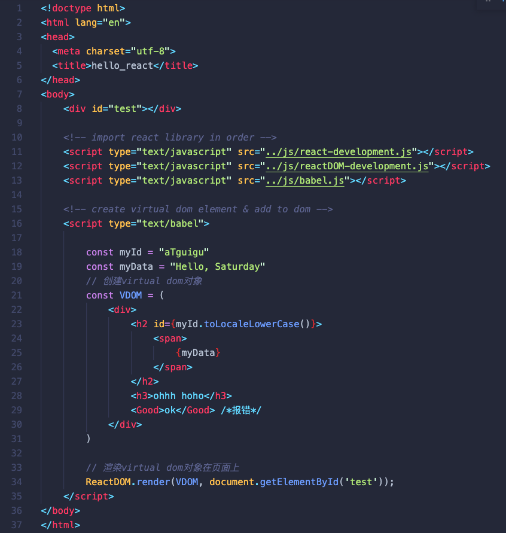

3. 组件

    a. 组件 vs 模块
    
        - 模块: 向外提供特定功能的js程序, 一般就是一个js文件
        - 组件: 用来实现局部功能效果的代码和资源的集合(html/css/js/image等等资源)
    
    
    b. 函数组件 -- 简单组件 (组件无状态)
    
    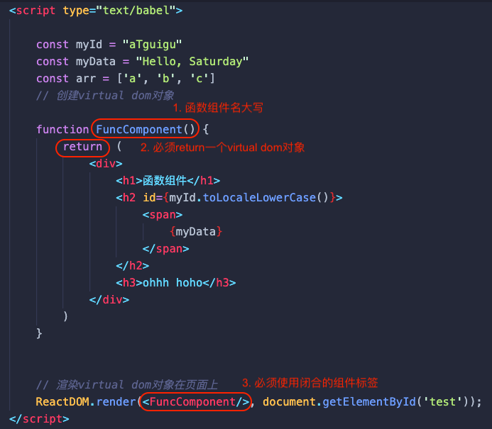
    
    
    c. 类组件 -- 复杂组件 (组件有状态)
    
    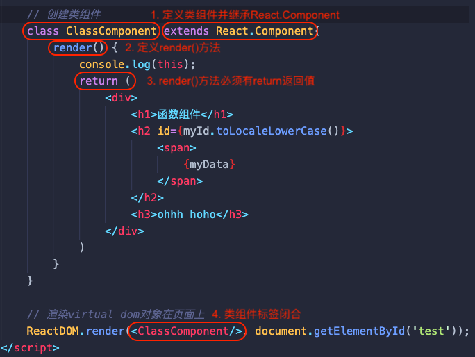
    
    
    d. 组件实例 ( 类式组件 ) 的三大核心属性: state, props, refs
    
        (1). state -- 设置组件内部状态数据
                - state 是一个对象, 里面存放键值对代表class member + val
                - 组件被称为"状态机", 通过更新组件的state来更新对应的页面显示(重新渲染组件)
                - 组件中constructor 和 render方法中的this为组件实例对象
                - 组件自定义的方法中this为undefined, 需要
                    a. 强制绑定this: 通过函数对象的bind()
                    b. 箭头函数 + 赋值语句
                - 状态数据不能直接修改, 需要借助this.setState({key: val})
                
    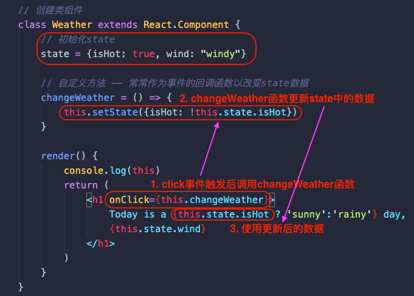

        (2). props -- 将外部数据传入组件
                - 每个组件对象都会有props(properties的简写)属性
                - 组件标签的所有属性都保存在props中
                - 通过标签属性从组件外向组件内传递变化的数据
                - 组件内部不能修改props数据, props是read-only
                
    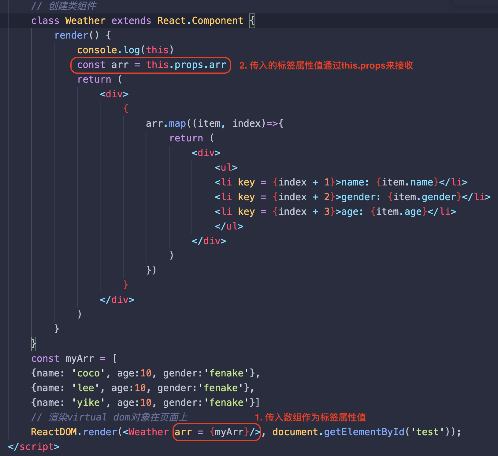
    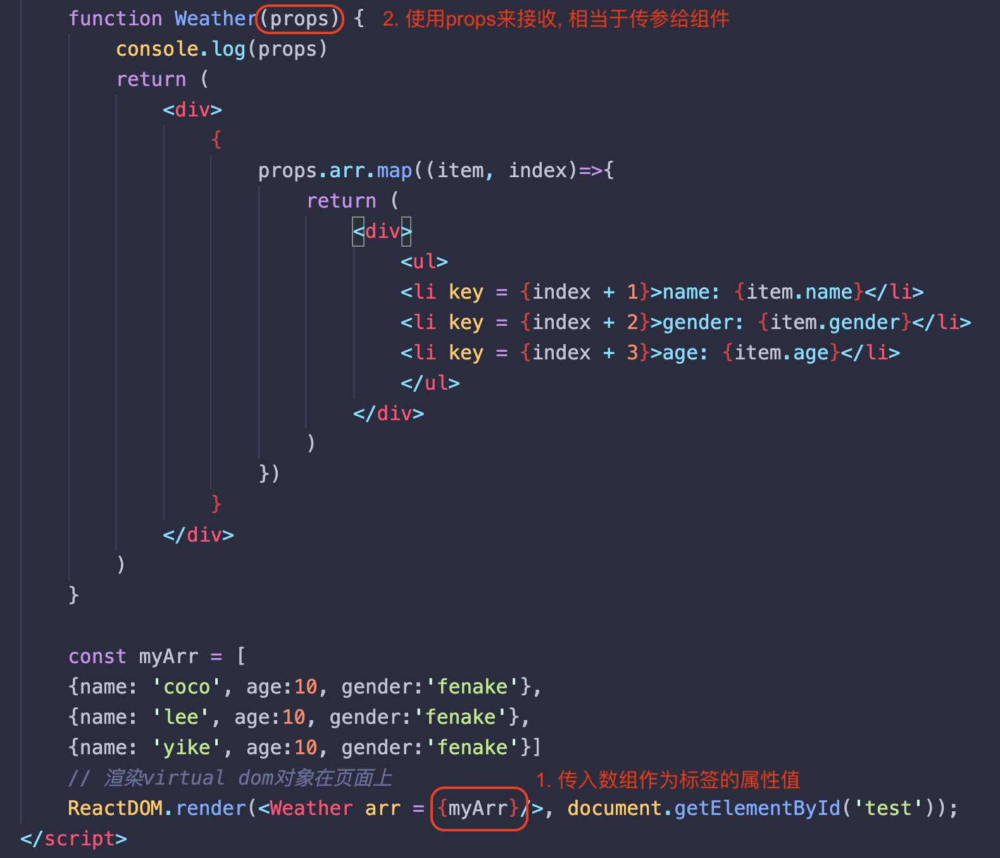
    
        (3). refs -- 定位virtual dom对象
        
            a. string形式的ref -- 性能最慢, 不推荐 ❌
            b-1. 回调inline函数形式的ref  -- 工程常用 ⭐️⭐️⭐️⭐️
            
    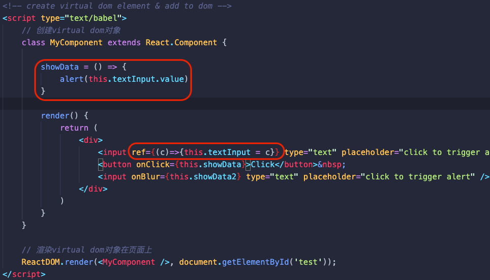
            
            b-2. 回调外部函数形式的ref ⭐️⭐️⭐️
            
    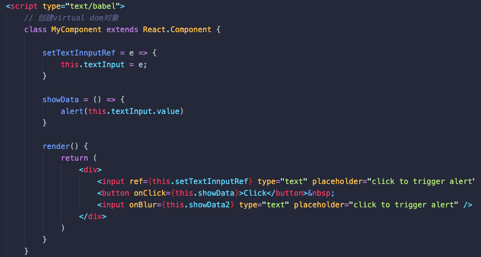
    
            c. React.createRef() -- 官方推荐使用 ⭐️⭐️⭐️⭐️⭐️
    
    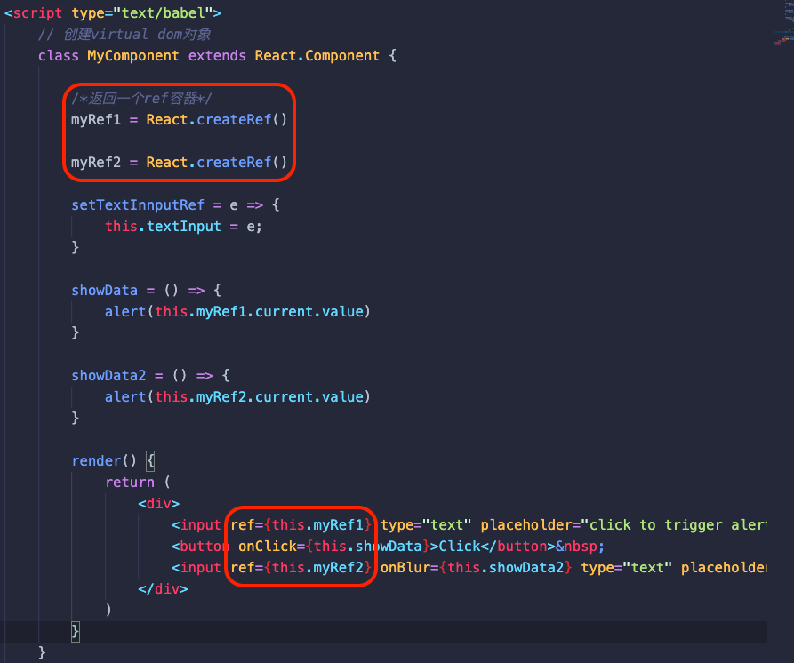

    e. 受控组件 & 非受控组件
    
            (1). 非受控组件
                    - more like traditional HTML form elements
                    - data is stored in DOM, not in component
                    - use ref to retrieve values for the DOM
    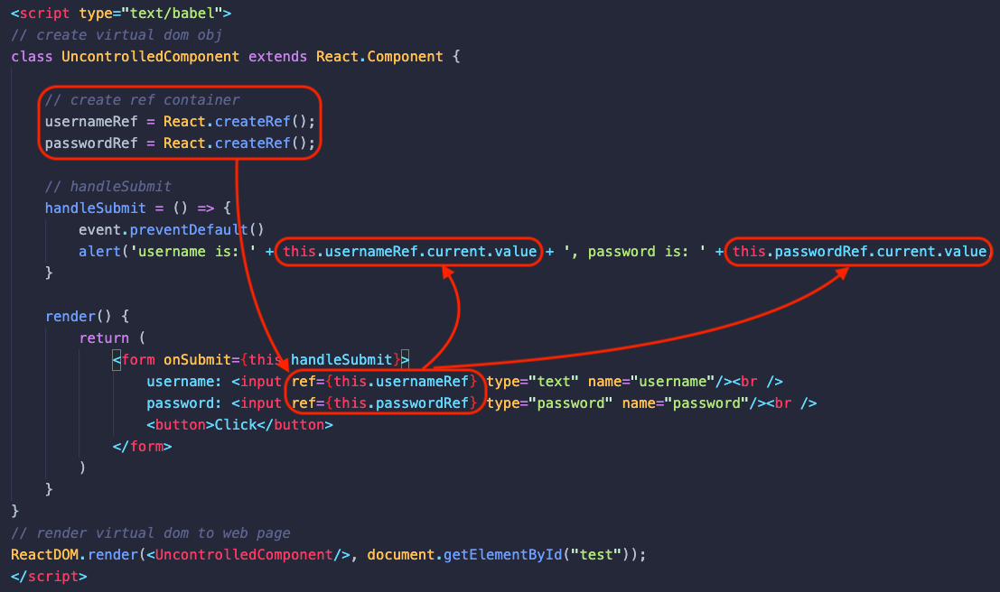
    
            (2). 受控组件 (推荐)
                    - form data is binded with state in real time
                    - the state within the component serves as "the single source of truth" for input elements that are rendered by the component
    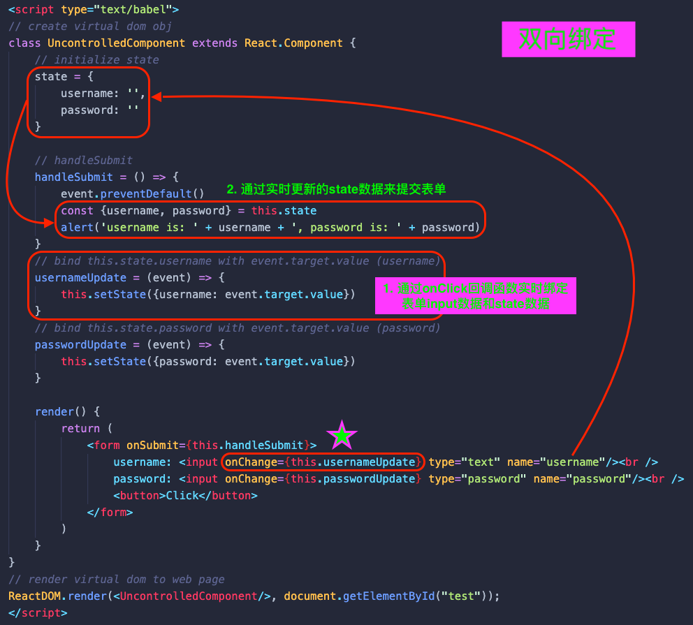

                受控组件的高阶函数写法:
    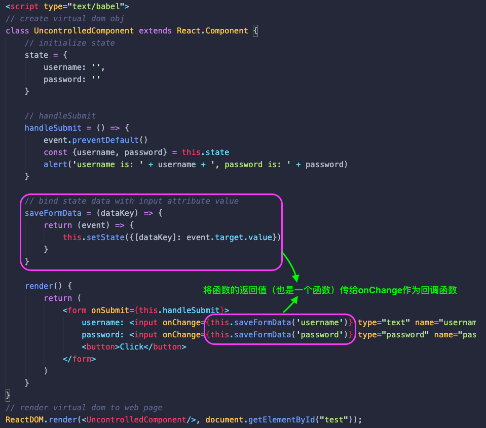
    
                    - 高阶函数: 如果一个函数符合下面2个规范中的任何一个, 就称该函数为高阶函数
                        a. 若A函数, 接收的参数是一个函数, 那么A就可以称之为高阶函数
                        b. 若B函数, 调用的返回值依然是一个函数, 那么A就可以称为高阶函数, eg: arr.map(()=>{})
                    
                    - 函数的柯里化: 通过函数调用继续返回函数的方式, 实现多次接收参数最后统一处理的函数编码方式
    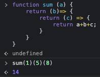
   
   
    f. 组件声明周期
    
    旧版本:
    
            1. 初始化挂载阶段: 由ReactDOM.render()触发 --- 初次渲染
                    - constructor()
                    - componentWillMount()
                    - render()
                    - componentDidMount() ====> 常用, 一般在这个钩子中做一些初始化的事, 
                        例如: 开启定时器, 发送网络请求, 订阅消息等
            2. 状态更新阶段: 由组件内部this.setState()或父组件render()触发
                    - shouldComponentUpdate()
                    - componentWillUpdate()
                    - render()
                    - componentDidUpdate()
            3. 卸载组件: 由ReactDOM.unmountComponentAtNode()触发
                    - componentWillUnmount() ====> 常用, 一般在这个钩子中做一些收尾的事, 例如: 关闭定时器, 取消订阅消息等
            
    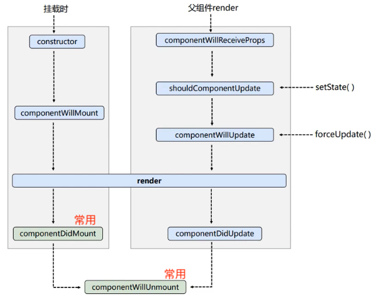

    新版本:
    
            1. 初始化挂载阶段: 由ReactDOM.render()触发 --- 初次渲染
                    - constructor()
                    - getDerivedStateFromProps()
                    - render()
                    - componentDidMount() 
            2. 状态更新阶段: 由组件内部this.setState()或父组件render()触发
                    - getDerivedStateFromProps()
                    - shouldComponentUpdate()
                    - render()
                    - getSnapshotBeforeUpdate()
                    - componentDidUpdate()
            3. 卸载组件: 由ReactDOM.unmountComponentAtNode()触发
                    - componentWillUnmount() 
    
4. 路由

    a. SPA的理解
    
        1. 单页Web应用 (single page web application, SPA)
        2. 整个应用只有一个完整的页面
        3. 点击页面中的链接不会刷新页面, 只会做页面的局部更新
        4. 数据都需要通过ajax请求获取, 并在前端异步展示
        
    b. 路由的理解
    
        前端路由: 
            1. 浏览器端路由, value是component, 用于展示页面内容
            2. 注册路由: <Router path="/test" component={Test}>
            3. 工作过程: 当浏览器的path变为/test时, 当前路由组件就会变为Test组件
        
        前端路由工作原理:
            1. 点击路由链接, 改变浏览器的历史记录路径, 因而被前端路由器所监测到
            2. 注册路由, 前端路由器根据浏览器路径的变化, 匹配并展示相对应的组件
        
    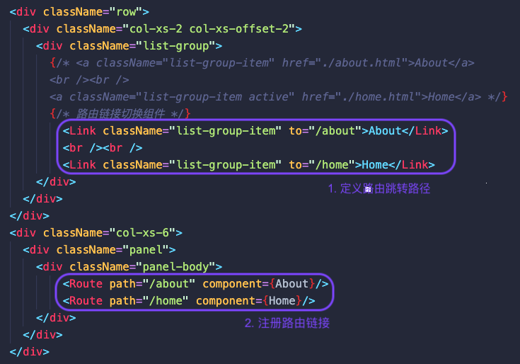
    
    c. 路由组件 vs 一般组件
        
            1. 写法不同:
                    一般组件: <Demo/>
                    路由组件: <Route path="/demo" component={Demo}/>
            2. 存放位置不同：
                    一般组件: components
                    路由组件: pages
            3. 接收到的props不同
                    一般组件: 写组件标签时传递了什么, 就能收到什么
                    路由组件: 接收到三个固定的属性 (history, location, match)
                        history:
                            go: f go(n)
                            goBack: f goBack()
                            goForward: f goForward()
                            push: f push(path, state)
                            replace: f replace(path, state)
                        location:
                            pathname: "/about"
                            search: ""
                            state: undefined
                        match:
                            params: {}
                            path: "/about"
                            url: "/about"

5. Redux

    a. 定义
            
            - 专门做状态管理的js库
            - 集中管理react应用中多个组件共享的状态
    
    b. 原理图
    
    

6. Hooks
    
    a. 定义
        
            - 可以在函数组件中使用state以及其他React特性
            - React 16.8.0之后的新语法
    
    b. 常用的3个Hook
        
            1. State Hook: React.useState() 
                - 使用state
                
    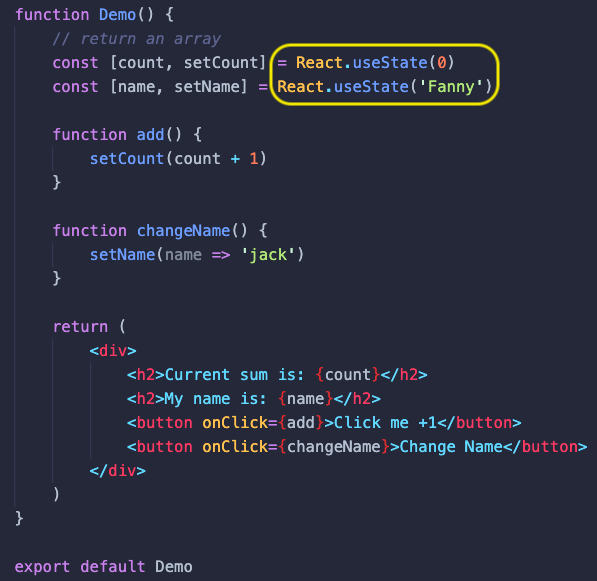
            
            2. Effect Hook: React.useEffect() 使用声明周期钩子
                - 在函数组件中执行副作用操作, 即模拟类组件中的生命周期钩子, eg: 发ajax请求, 设置订阅, 启动定时器, 手动更改真实DOM
                - 语法:
                    useEffect(() => {
                        return () => {
                            // 类似componentWillUnmount: 用于做一些收尾工作, 比如清除一些定时器, 取消订阅
                        }
                    }, [stateValue]) // 如果指定的是空[], 回调函数只会在第一次render()后执行, 相当于componentDidMount; 如果不是空[], 回调函数会在每次元素更新后执行, 相当于componentDidUpdate
                - 总结:
                    useEffect Hook 可以看做是三个钩子的组合:
                        - componentDidMount()
                        - componentDidUpdate()
                        - componentWillUnmount()
                        
    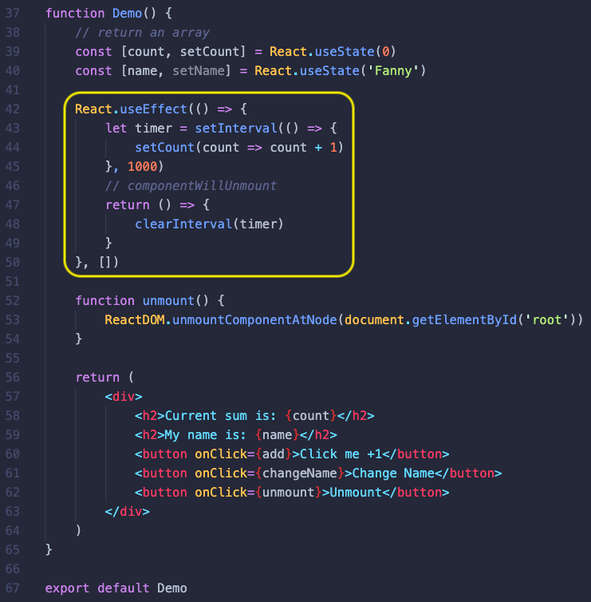
    
            3. Ref Hook: React.useRef()
                - 在函数式组件中存储/查找组件内的标签或任意其他数据
                - 语法: const refContainer = useRef()
                - 作用: 保存标签对象, 功能与React.createRef()一样
                
    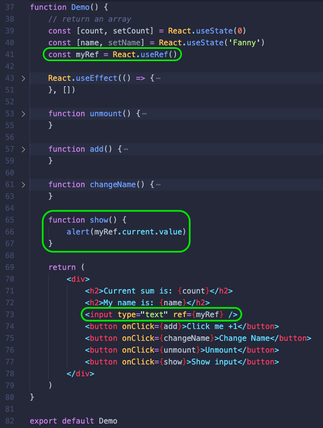

7. 组件优化

        a. Component的2个问题
            1. 只要执行setState(), 即使不改变状态数据, 组件也会重新render() ===> 效率低
            2. 只要当前组件重新render(), 就会自动重新render子组件, 纵使子组件没有用到父组件的任何数据 ===> 效率低
        
        b. 高效的做法:
            只有当组件的state或props数据发生变化时才重新render()
        
        c. 原因:
            Component中的shouldComponentUpdate()总是返回true
        
        d. 解决:
            使用PureComponent替换Component来优化性能
            PureComponent重写了shouldComponentUpdate(), 只有state或props数据发生变化了才返回true
            注:
                只是进行state和props数据的浅比较, 如果只是数据对象内部数据变了, 返回false
                因此, 更新state数据时不要直接更改state数据本身, 而要产生一个新的数据
                
